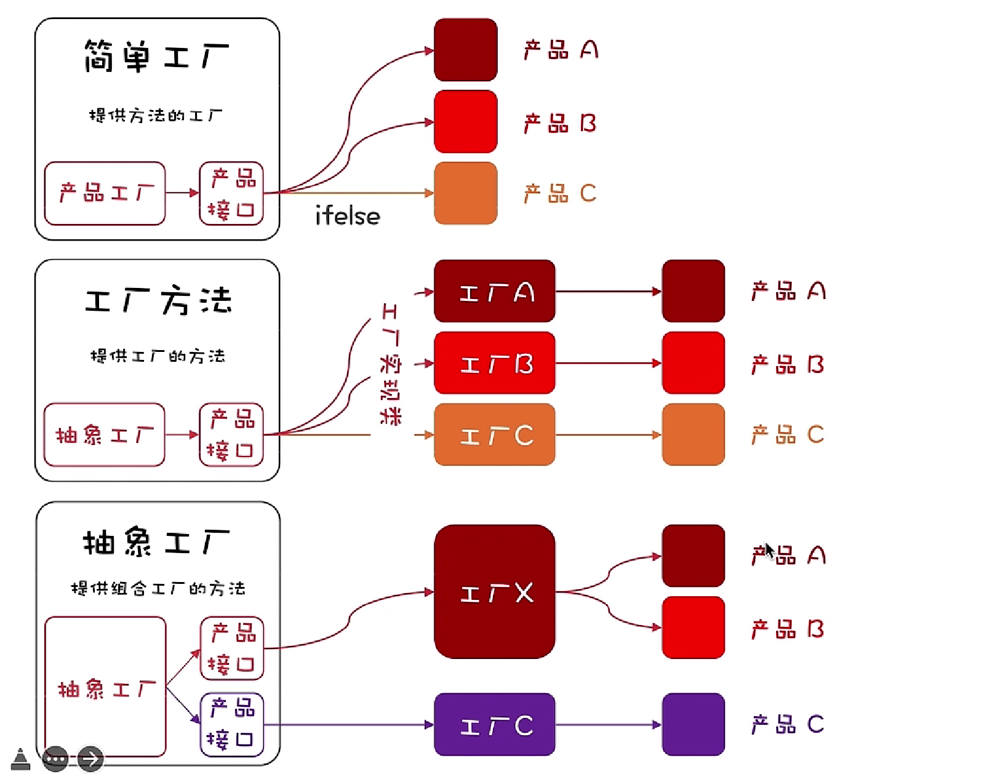

# 工厂方法模式解释文档

## 概念表

| 概念                     | 含义与类比                     | 示例中角色                                    |
|------------------------|---------------------------|------------------------------------------|
| 产品接口 (Product)         | 定义了产品的接口，是工厂方法创建的对象的共同接口。 | `Product` 接口                             |
| 具体产品 (ConcreteProduct) | 实现了产品接口的具体产品类。            | `ConcreteProductA`, `ConcreteProductB` 类 |
| 工厂接口 (Creator)         | 声明了创建产品的抽象方法，是工厂方法的核心。    | `Creator` 接口                             |
| 具体工厂 (ConcreteCreator) | 实现了工厂接口，负责实际创建产品的具体工厂类。   | `ConcreteCreatorA`, `ConcreteCreatorB` 类 |

## 含义与类比说明

1. **产品接口 (Product):**
    - **含义:** 定义了产品的接口，是工厂方法创建的对象的共同接口。
    - **类比:** 产品接口就像电商平台上的商品规范，规定了商品应该有的共同属性和行为。

2. **具体产品 (ConcreteProduct):**
    - **含义:** 实现了产品接口的具体产品类。
    - **类比:** 具体产品就像电商平台上的实际商品，根据规范具体实现了商品的特性和功能。

3. **工厂接口 (Creator):**
    - **含义:** 声明了创建产品的抽象方法，是工厂方法的核心。
    - **类比:** 工厂接口就像电商平台上的商家规范，规定了商家应该有的创建商品的方法。

4. **具体工厂 (ConcreteCreator):**
    - **含义:** 实现了工厂接口，负责实际创建产品的具体工厂类。
    - **类比:** 具体工厂就像实际的商家，根据商家规范具体实现了创建商品的方法。

## 适用场景

工厂方法模式适用于以下场景：

1. 一个系统要独立于它的产品的创建、组合和表示时。
2. 一个系统要配置多个产品时，并且每次只使用其中的一个产品。
3. 需要对产品的组合进行创建时。

## 优缺点总结

### 优点

1. 封装性良好，降低耦合度。
2. 扩展性强，符合开闭原则。

### 缺点

1. 类的个数增加。
2. 开发复杂度增加。

### 简单工厂模式：开始的时候，可能只有一种产品，而为了简化客户端的创建过程，引入了简单工厂。这个简单工厂负责创建产品的实例。

### 工厂方法模式：用于创建一组相似但不完全相同的产品，每个产品有自己的工厂。不同的工厂可以创建不同类型的产品，使得系统更容易扩展和维护。

### 抽象工厂模式：用于管理不同的工厂，每个工厂负责创建一整个产品族。当系统的需求更加复杂，可能需要同时生产多个相关或相互依赖的产品族时，引入了抽象工厂模式。这个模式允许一个工厂接口创建多个不同类型的产品。

